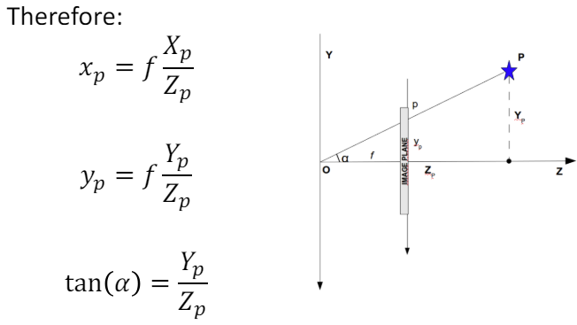

I recently completed a Computer Vision course as part of my Master's program in Information Engineering at the University of Padova. The course, taught by Professor Stefano Ghidoni, was a key component of my Erasmus semester. This review summarizes the main concepts and topics covered during the class, which I successfully passed at the conclusion of my exchange program. You'll be able to find the course's outline in the end of this post.

# Global review
The Computer Vision course offered a comprehensive overview of the field, living up to the professor's promise of covering the entire spectrum from basic object representation in cameras to advanced deep learning techniques using convolutional neural networks.

Weekly two-hour lab sessions complemented the theoretical lectures, providing hands-on experience with the OpenCV library. We worked in C, using CMAKE files to streamline the compilation process. These practical sessions were designed to prepare us for the final group project.
Our final project involved analyzing pool game videos from multiple angles and with varying table/background colors. The main objectives were to:
- Segment the pool table and balls
- Color-code elements (green for the table, blue for solid balls, red for striped balls)
- Detect and track ball movements
- Create a bird's-eye view map of the pool table

While challenging, especially given my impending return to France, our group managed to pass the project. However, I feel I could have contributed more given different circumstances. We eventually managed to obtain a good 7.25 out of 10.

The final exam was moderately challenging. Although I performed well, I believe there was room for improvement. The most valuable aspect of the course was the learning process itself. I developed a skill for distilling complex presentations into concise, well-explained concepts. YouTube proved to be an invaluable resource for understanding the mathematical principles underlying image transformations.
I conclude this course with a set of clear, comprehensive notes that I'm confident will serve as a quick reference should I engage with computer vision in the future. The knowledge gained has provided a solid foundation in this field.

# Course summary
## Pixel operations, histograms and filtering
There are different ways of transforming an image :
- Single pixel operations (The output value of each pixel depends on the pixel initial value)
- Local operations (The output value depends on the initial values of the pixel + its neighbors)
- Geometric transforms

Several single pixel operation filters exist such as negative (switches dark and light on original image), log filter (highlights difference between pixels (contrast)), gamma (similar to log but tunable with gamma parameter), contrast streching and thresholding (compares each pixel value to the threshold, if lower then we assign the predefined low value ($$L$$) else, we assign the predefined high value ($$H$$)).

We can also use the histogram of a grey image and equalize it in order to make the objects stand out. **Histogram Equalization** is a technique used in image processing to enhance the contrast of an image. It works by redistributing the intensity values in the image by using a special function so that the histogram becomes flat. As you can observe here: 
{: width="500"}

**Local operations** are defined based on a filter/kernel around the pixel. A filter can change image brightness but it is unchanged if the weights of the filter sum up to 1. We studied *linear/smoothing filters* (averaging, 1st order derivative and 2nd order derivative filters) one of the most intersting one was the Sobel filter which will talk about later. But also non-linear filters (min, max, median) which advantage is that they can suppress components such as noise (Gaussian, Rayleigh, Gamma, Exponential, Uniform or even Salt & Pepper noise) for image restoration.

## Edge detection
Mid-level image processing is based on more complex models (edge, line, blob detection, salient features, keypoints, texture).

**The Sobel edge detector** is an *isotropic* detector (directionally independent) which derives from the gradient operation applied to discrete values:
- $$g_x=f(x+1,y)-f(x,y)$$
- $$g_y=f(x,y+1)-f(x,y)$$

Which gives us the Sobel horizontal/vertical operators :
$$
G_x=
\begin{pmatrix}  
	-1 & 0 & 1\\  
	-2 & 0 & 2\\
	-1 & 0 & 1
\end{pmatrix}
\hspace{1cm}
G_y=
\begin{pmatrix}  
	-1 & -2 & -1\\  
	0 & 0 & 0\\
	1 & 2 & 1
\end{pmatrix}
$$
Applying these operators to each pixel (and its surroundings) gives us a $$G_x$$ and $$G_y$$ value which we can then use to compute 2 important measures which are the gradient magnitude (how strong is the edge) $$G=\sqrt{G_x^2+G_y^2}$$ and the gradient phase (angle of the edge) $$\theta=arctan(\frac{G_y}{G_x})$$

However, Sobel is sensitive to noise so it's common to use Gaussian blur first and then Sobel edge detector.

**The Canny edge detector** allows to specifically preserve edges that should be forgotten because they're very hardly detectable such as the one on the ball below. 

{: .normal width="300"}

It works by basically taking the output of the Sobel filter and then performing a 2 steps algorithm :
- step 1 is thinning all edges to make them 1 pixel wide
- step 2 is removing edges that are not strong enough (using hysteresis thresholding)

**The Hough transform line detector** is also mathematically really interesting. Please take a look at [this](https://youtu.be/X1DxCPS1iwA?si=WExqxa3nt7mdKtMx) well made video if you want to understand it.

Another way to perform "shape" detection is to use **morphological operators** in order to refine an image mask (grayscale image used to define a region of interest (ROI) within another image). For example we can use *erosion* for thinning and separate weakly connected components, *dilation* to thicken and merge close unconnected components (see below), *opening* (which is an erosion followed by a dilation) useful for smoothing edges of segmented objects/remove small objects/remove objects with specific shape and *closing* (dilation followed by erosion) to fill in small holes in an image while preserving shape of an object.

{: width="400"}
_Dilation_

## Segmentation
Segmentation is a very popular field in computer vision which goal is to partition an image into regions. Following 2 main criteria : similarity (between pixels in the same region) and discontinuity (between pixels in different regions).

We studied the **thresholding** approach using *Otsu* algorithm. A threshold's effectiveness depends on the distance between peaks (histogram), image noise, relative size of regions and illumination. Otsu's method aims at finding that threshold assuming that 2 classes are created by thresholding. The goal is then to find the optimal threshold that maximizes inter-class variance and minimizes intra-class variance. (this method is mathematically interesting as well)

We then studied the **region growing** approach which group pixels of subregions into larger ones. It starts with a seed pixel (or more) and iteratively adds neighboring pixels to the region if they meet certain criteria. These criteria typically involve comparing the pixel's intensity or color to the average intensity or color of the region.

Then we reviewed the **Watershed** algorithm which provide a solution to segment connected areas as below
{: width="400"}

The algorithm is inspired by the concept of a watershed in hydrology. It treats the image as a topographic surface, where pixel intensities represent elevations. The algorithm identifies catchment basins (regions) that are separated by watersheds (edges).

Finally we saw 2 **clustering methods** which approach is to consider the segmentation problem as a clustering problem and then segment the clusters. To apply such algorithm we must first consider each pixel as a feature vector and then apply *K-means* or *mean shift* clustering to these vectors (considered as points). 

*K-means* : Choose K random points in the set or in the space (not necessarily in the set). Partition the set in K partitions considering each one of the random chosen points as the center of each partition. Then calculate the mean of each partition (by summing the points values and dividing by the number of points in the partition) and move the previously randomly chosen center towards that mean (centroid ie center of mass).
Repeat the previous steps again and again until the clusters are stabilized and then you have your final partitions which should each represent a segment of the image. We can see below that we can cluster by considering only features that we are interested in !
{: width="500"}

*Mean shift* : non-parametric clustering algorithm that works by finding modes (dense regions) in the data distribution. It is a gradient ascent algorithm that iteratively moves data points towards regions of higher density.

## Feature detection
A feature is a "meaningful" part of an image. Features are defined by their *keypoint* and their *descriptor* (vector representation of the surrounding area (color, texture, orientation)). 

During the couse we've studied multiple feature detectors such the **Harris corner detector** which allow us to build a real and symmetric *auto-correlation* matrix from the image which means its eigenvectors are orthogonals and point to the direction of max data spread (thus the corners). With eigenvalues, we get information about the type of patch : 
- If both eigenvalues are small: uniform region 
- Only one large eigenvalue: edge 
- Two large eigenvalues: corner

We also approached the **USAN/SUSAN corner detector**, the **SIFT feature detector** and many other feature detectors.

## The pinhole camera model & Projective geometry
The **pinhole camera model** provides a mathematical framework for understanding how a camera captures images. It establishes a coordinate system to represent the geometric relationship between the camera and the scene.
{: width="400"}

Using **projective geometry**, we simplify the pinhole camera model and derive mathematical equations that describe the relationship between the 3D world and its 2D projection on the image plane:
{: width="300"}

This is the easy part. Now that we have the object real coordinates we have to convert them into pixel coordinates. First, we convert Cartesian coordinates into homogeneous coordinates which means $$(x,y,z)$$ becomes $$(x,y,z,w)$$ where $w$ is a non-zero scalar. Then we use *perspective projection* (and a projection matrix) which is the process of projecting a 3D point onto a 2D plane (the image plane) from a specific viewpoint (the camera). And then we get $$(x,y)$$ as the object's coordinates. 

We then need to map $(x,y)$ into its $(u,v)$ pixel values using some real to pixel coordinates conversion factors. We can shorten the process by putting all these equations into the same big one and thus changing a bit the projection matrix that we had.

We also tackled *roto-translations* which is the combination of rotation and translation transformations applied to points in space. In projective geometry, these transformations are often represented using homogeneous coordinates and transformation matrices, which simplify the computations and make the mathematical operations more robust. This was a fun and easy to understand concept. 

## Geometric transformations and Camera calibration
Following the roto-translations, we reviewed all possible 2D geometric transformations and their corresponding matrices. 

Then we tackled the camera model and how lenses worked. There are 2 exposure parameters: the *aperture* (diameter of lens opening therefore a fraction of f, also controls the depth of field) and the *shutter speed* (exposure time ie a fraction of second).

Usually thin lenses are used the make the rays of an object converge on the sensor. There are non ideal lenses which may not be perfect and cause distortion (radial or tangential), chromatic aberrations and other effects.

*Camera calibration* is the process of estimating the camera parameters (projection characteristics of a camera). We did practical work on that subject trying to calibrate a laptop's camera using opencv. That way I understood all aspects of a camera.

## Object recognition & Deep learning
Some object recongition techniques we saw are the Viola and Jones algorithm (for face detection) which we can actually use for objects. But also template matching (comparing portions of an image against a pre-defined template image), Histogram of Oriented Gradients (particularly effective in capturing the shape and structure of objects in images), Bag of Words (comes from document analysis, the principle is to decompose an image into parts and then look at what are the parts that appear the most and which other image have the same eatures).

We explored machine and deep learning methods for tasks like recognizing and classifying objects. It was fascinating to discover how deep learning techniques originally developed for natural language processing could also be applied to computer vision. This suggests that deep learning might be a universal approach to data processing, uniting various scientific fields.

# Course outline (as given by teacher)
**Low-level image processing** : Single pixel and histogram-based transform • Linear filters • Non-linear filters

**Mid-level image processing** Edge detection, derivative • Corner detection • Blob detection • Hough transform • Segmentation

**Image features** Keypoint detection and feature descriptor calculation • Feature matching

**High-level vision** Object detection & recognition • Image (semantic) segmentation • Machine learning for computer vision

**Image formation, cameras and colors** Imaging systems • Cameras: sensors, optics, camera working principle • Colorimetry: color spaces, color matching

**Projective geometry** Geometric representation of the image formation process • Non-ideal cameras • Reference systems

**Camera calibration** Study of lens distortion • Compensation of lens distortion • Zhang calibration method

**Deep Learning for computer vision** Deep networks dedicated to image processing • End-to-end learning • Transfer learning & fine-tuning

**C++** Templates: libraries and classes • Class hierarchies and inheritance • Data management & processing for computer vision

**Computer vision system designs** Intro to OpenCV, image loading, pixel manipulation, color spaces • Camera Calibration • Image equalization, histograms and filters • Hough transform and edge detection • Keypoints, descriptors and matching: building a panoramic image • Keypoints, descriptors and matching: object detection • Machine learning / deep learning: object detection
