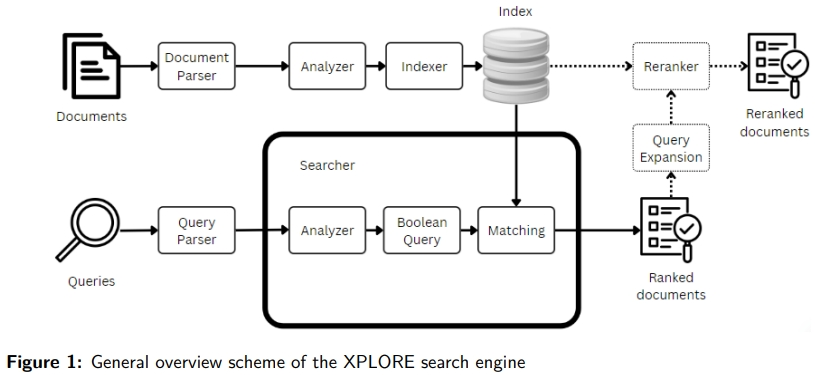

Search Engines was my first class at UNIPD. While it was interesting, I found parts of it challenging. The teacher covered a lot of complex topics without diving too deep. I understand there’s a lot to learn, but I think it would have been better to spend more time on each concept. The fast pace made the project and exam stressful, as many of us struggled to fully grasp all the information. However we achieved to get 28/30 for the project and 8/12 at the exam.

## How does a search engine work ?
We can decompose the process of a search engine into 2 streams. The 1st one beign the one of the queries and the other the one for the documents. In fact, documents and queries are treated the same at the beginning but then there are many ways to treat them separately depending on what aspects we want our search engine to be good at. 

The general components that are used are :
- the parser, cleans up the documents/queries before they are processed. This means getting rid of the unwanted stuff such as ponctuation, mispellings, etc...
- the analyzer, breaks down the documents/queries into tokens (tokenization) and analyze them separately. The analyzing part usually involves POS tagging and word N-grams processing
- the indexer, creates a searchable database that processes documents and makes them known as an index
- the searcher it's the most important one. It is responsible for adapting the queries into a data form that we can compare to the documents using some kind of similarity function

These components should be adapted to whether we process documents or queries as you can see below.
{: width="400"}

The class was basically about reviewing all the techniques that exist for each component and trying to understand how they worked. We also had tutorships to practice on real datasets. Finally, we had to submit a project that was very important for the final grade.

## The project
[My homework](../assets/homework-1.pdf)